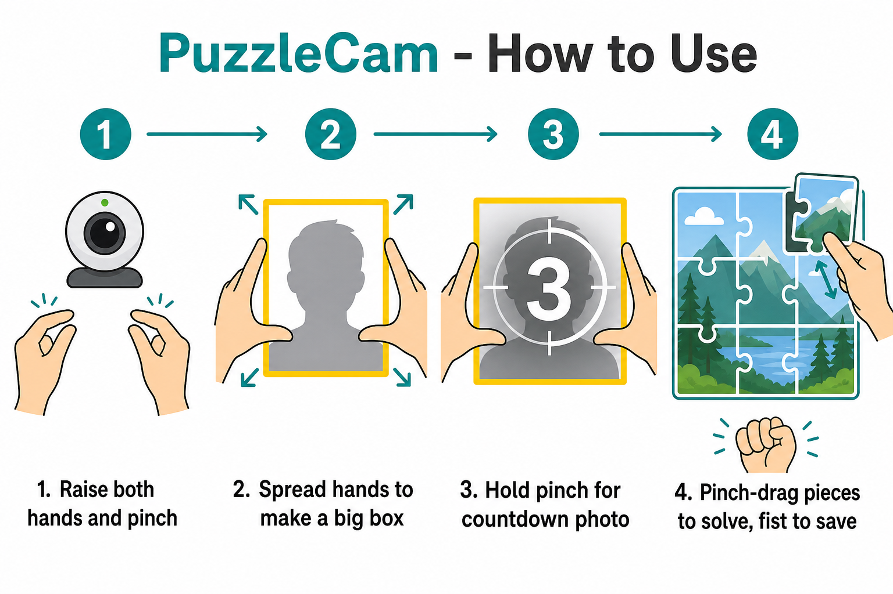

# PuzzleCam: Gesture Capture

Browser photobooth controlled by hand gestures. No install, no backend.

Based on [mishu006/Puzzle](https://github.com/mishu006/Puzzle). UI in English.

## What it does

Uses your hands as a photo frame, captures that area, turns it into a 3x3 black-and-white puzzle, and lets you solve it with pinch gestures.



## Run (browser)

```bash
cd PuzzleCam
python3 -m http.server 5500
```

Open: [http://localhost:5500](http://localhost:5500)

Full instructions: [`RUN.md`](RUN.md)

## Run (Python, laptop only)

Same gestures in an OpenCV window. Uses the same MediaPipe hand model as GestureHome.

```bash
cd PuzzleCam
conda activate home   # or: pip install -r requirements.txt
python puzzle_cam.py
```

| Key | Action |
|-----|--------|
| `q` | Quit |
| `r` | Reset puzzle (or reset all when strip is full) |
| `d` | Download photo strip when 3 puzzles are saved |
| `m` | Toggle mirrored preview |

Saves individual puzzles and strips to `output/`.

## Gestures (original)

| Gesture | Action |
|---------|--------|
| Both hands pinching | Create the capture frame |
| Hold both pinches | Countdown + capture |
| One-hand pinch on a piece | Drag puzzle piece |
| Hold closed fist | Save / reset |

## Files

| File | Purpose |
|------|---------|
| `index.html` | Browser app page |
| `app.js` | Browser hand tracking + puzzle logic |
| `puzzle_cam.py` | Python OpenCV + MediaPipe version |
| `css/styles.css` | Styles |
| `puzzlecam-how-to.png` | How-to diagram |
| `RUN.md` | Step-by-step instructions |
| `requirements.txt` | Python dependencies |
| `README.md` | This file |

## License

MIT
